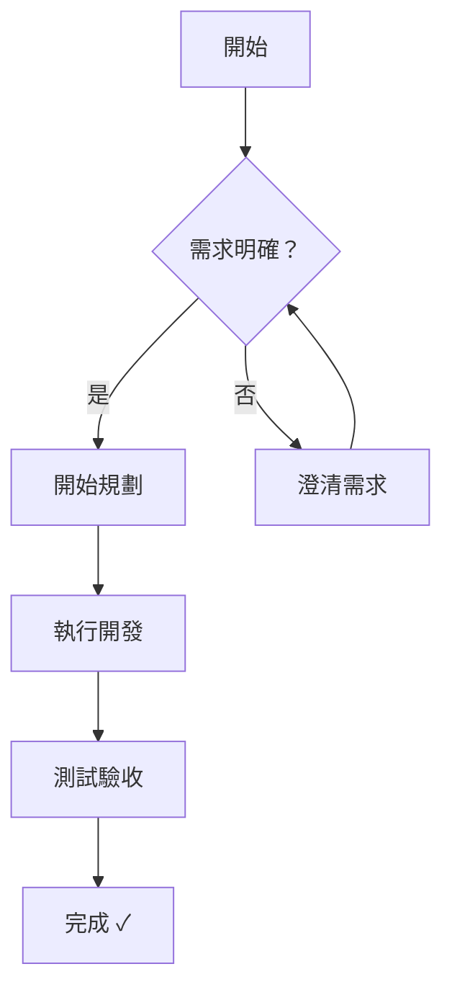
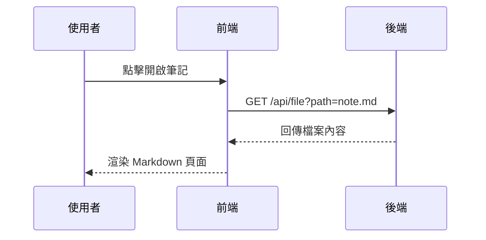
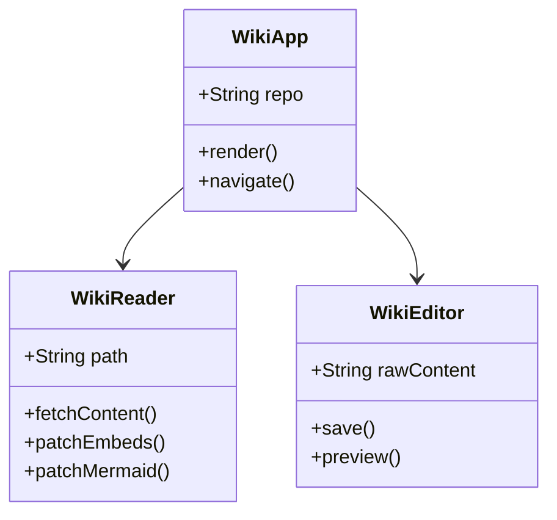
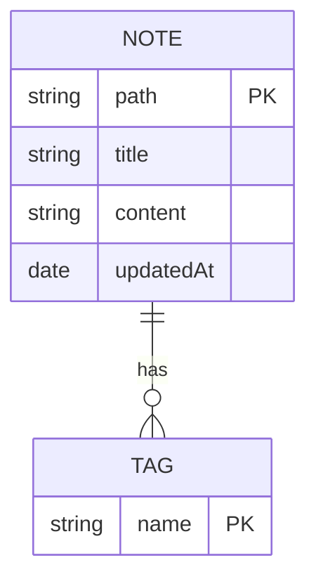

# Markdown 語法全攻略

這是一份完整的 Markdown 語法教學範例，您可以透過這份文件了解 Tiny Wiki 支援的所有排版功能。

---

## 1. 標題 (Headers)

使用 `#` 來定義標題，`#` 的數量代表標題的等級（建議一頁只有一個一級標題）。

# 一級標題 (H1)
## 二級標題 (H2)
### 三級標題 (H3)
#### 四級標題 (H4)
##### 五級標題 (H5)

---

## 2. 文字樣式 (Emphasis)

您可以使用符號來強調特定的文字：

*   **粗體**：使用 `**文字**` 或 `__文字__`
*   *斜體*：使用 `*文字*` 或 `_文字_`
*   ***粗斜體***：使用 `***文字***`
*   ~~刪除線~~：使用 `~~文字~~`

---

## 3. 列表 (Lists)

### 無序列表
*   項目一
*   項目二
    *   子項目 A
    *   子項目 B

### 有序列表
1.  第一步
2.  第二步
3.  第三步

---

## 4. 連結與圖片 (Links & Images)

*   **連結**：[點擊前往 Google](https://www.google.com)
*   **內部連結**：[前往 Note 1](note1.md)
*   **Obsidian Wikilinks**：
    *   `[[note1]]` -> [[note1]] (自動搜尋檔名)
    *   `[[folder1/note2]]` -> [[folder1/note2]] (指定路徑)
    *   `[[note1|我的筆記]]` -> [[note1|我的筆記]] (自定義別名)
*   **圖片**：
    


---

## 5. 引用 (Blockquotes)

> 這是引用的樣式。
> 適合用來標註名言、參考資料或是補充說明。
> 
> > 甚至支援巢狀引用。

---

## 6. 程式碼 (Code)

### 行內程式碼
在句子中插入 `const app = createApp(App)` 這樣的程式碼。

### 程式碼區塊
支援語法高亮 (Syntax Highlighting)：

```javascript
// 這是一段 JavaScript 範例
function welcome() {
  const message = "歡迎使用 Tiny Wiki！";
  console.log(message);
}

welcome();
```

```css
/* 這是一段 CSS 範例 */
.wiki-reader {
  font-family: 'Inter', sans-serif;
  line-height: 1.6;
}
```

---

## 7. 表格 (Tables)

| 功能 | 語法範例 | 預覽 |
| :--- | :--- | :--- |
| **粗體** | `**Bold**` | **範例** |
| **斜體** | `*Italic*` | *範例* |
| **程式碼** | `` `Code` `` | `範例` |

---

## 8. 分隔線 (Horizontal Rules)

使用三個以上的破折號 `---` 即可產生：

---

## 9. 任務列表 (Task Lists)

* [x] 已完成配色優化 (Earthy Tones)
* [x] 已整合頂級字型 (Outfit & Inter)
* [ ] 規劃下一個新功能

---

直接輸入網址也會自動轉為連結：https://github.com/

---

## 11. 內部頁面連結 (Internal Links)

您可以透過相對路徑連結到 Wiki 內的其他頁面，點擊後會直接在應用內切換：

*   **連結到同目錄檔案**：[連結到 Note 1](note1.md)
*   **連結到子目錄檔案**：[連結到 Folder 1 內的 Note 2](folder1/note2.md)
*   **使用相對路徑**：`[顯示名稱](路徑/檔名.md)`

---

## 12. 數學公式 (Math — KaTeX)

Tiny Wiki 支援 [KaTeX](https://katex.org/) 數學公式語法，與 Obsidian 相容。

### Inline 公式

在文字中插入公式，使用單個 `$` 包住：

愛因斯坦的質能等價公式 $E = mc^2$ 是物理學的基石。

歐拉恆等式 $e^{i\pi} + 1 = 0$ 被譽為數學中最美麗的公式。

二次方程的解為 $x = \dfrac{-b \pm \sqrt{b^2 - 4ac}}{2a}$。

### Block 公式

獨立一行顯示，使用 `$$` 包住：

$$
\int_0^\infty e^{-x^2}\,dx = \frac{\sqrt{\pi}}{2}
$$

$$
\sum_{n=1}^{\infty} \frac{1}{n^2} = \frac{\pi^2}{6}
$$

$$
\mathbf{F} = m\mathbf{a} = \frac{d(m\mathbf{v})}{dt}
$$

---

## 13. 流程圖與圖表 (Diagrams — Mermaid)

Tiny Wiki 支援 [Mermaid](https://mermaid.js.org/) 繪圖語法，與 Obsidian 相容。使用 ` ```mermaid ` 開頭的程式碼區塊即可。

### Flowchart（流程圖）



### Sequence Diagram（時序圖）



### Class Diagram（類別圖）



### ER Diagram（實體關係圖）


